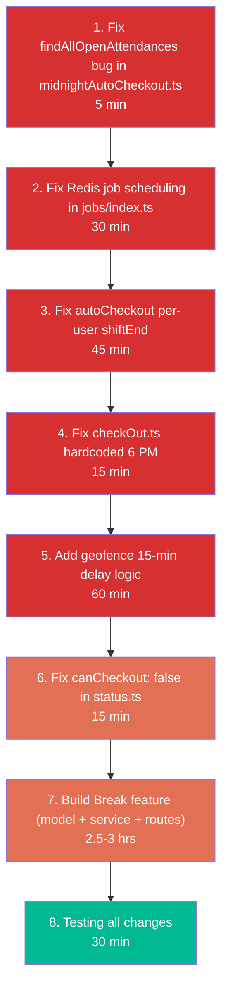

# Schedio Backend — Master Plan

> **Date**: 2026-03-27 | **Total Estimated Time**: ~6-7 hours

---

## All Items at a Glance

| # | Priority | Item | Type | EST |
|---|----------|------|------|-----|
| 1 | **P0** | Auto-checkout uses hardcoded 6 PM instead of user shiftEnd | Bug Fix | 45 min |
| 2 | **P0** | Redis overload from MIDNIGHT_AUTO_CHECKOUT repeatable job | Bug Fix | 30 min |
| 3 | **P0** | Geofence auto-checkout: hardcoded 6 PM + missing 15-min delay | Bug Fix | 60 min |
| 4 | **P1** | Checkout status blocks user (`canCheckout: false`) | Bug Fix | 45 min |
| 5 | **P1** | Break / Tea Break system | New Feature | 2.5-3 hrs |

---

## ISSUE 1 (P0) — Auto-Checkout Should Use Per-User shiftEnd

### Current Problem
[autoCheckout.ts](file:///c:/Users/asus/Desktop/Coder%20Roots/Schedio/Schedio%20backend/src/services/attendance/commands/autoCheckout.ts) has a hardcoded 6 PM gate on line 18:

```typescript
if (currentHour < 18) {
  console.log("[AutoCheckout] Skipping - before 6 PM");
  return { processed: 0 };
}
```

This checks out ALL open attendances at 6 PM regardless of individual shift timings. A user with `shiftEnd: "20:00"` gets auto-checked-out 2 hours early.

### Root Cause
The function treats all users identically with a global `currentHour < 18` gate, then bulk-processes all open attendances.

### Fix

> [!IMPORTANT]
> The fix must process users individually based on their own shiftEnd.

**Step 1 — Remove the global 6 PM gate**

Remove the `if (currentHour < 18)` early return.

**Step 2 — Filter per-user by shift end time**

For each open attendance record, check if the current time is past that user's shiftEnd. Only auto-checkout users whose shift has ended.

**Step 3 — Updated logic**

```diff
- const currentHour = new Date().getHours();
- if (currentHour < 18) {
-   console.log("[AutoCheckout] Skipping - before 6 PM");
-   return { processed: 0 };
- }
+ const timezone = "Asia/Kolkata";
+ const now = Date.now();
```

Inside the `.map()` loop, add per-user shift check before processing:

```typescript
const shiftEndMinutes = shiftEnd
  ? timeStringToMinutes(shiftEnd)
  : 1080; // default 18:00
const currentMinutes = timestampToMinutesInTimezone(now, timezone);

if (currentMinutes < shiftEndMinutes) {
  return; // shift not over for this user, skip
}
```

**Step 4 — Schedule a periodic BullMQ job**

Currently there is no repeating job for [autoCheckout()](file:///c:/Users/asus/Desktop/Coder%20Roots/Schedio/Schedio%20backend/src/services/attendance/commands/autoCheckout.ts#11-77). Only the midnight one exists. We need to add a repeating job that runs every 30 minutes so it catches different shift-end times.

In [jobs/index.ts](file:///c:/Users/asus/Desktop/Coder%20Roots/Schedio/Schedio%20backend/src/jobs/index.ts):

```typescript
await appQueue.add('AUTO_CHECKOUT', {}, {
  repeat: { every: 30 * 60 * 1000 },
  jobId: 'auto-checkout-periodic',
});
```

In [app.worker.ts](file:///c:/Users/asus/Desktop/Coder%20Roots/Schedio/Schedio%20backend/src/jobs/workers/app.worker.ts), add the handler:

```typescript
case 'AUTO_CHECKOUT':
  await processAutoCheckout(job);
  break;
```

**Files to modify:**
- [autoCheckout.ts](file:///c:/Users/asus/Desktop/Coder%20Roots/Schedio/Schedio%20backend/src/services/attendance/commands/autoCheckout.ts)
- [jobs/index.ts](file:///c:/Users/asus/Desktop/Coder%20Roots/Schedio/Schedio%20backend/src/jobs/index.ts)
- [app.worker.ts](file:///c:/Users/asus/Desktop/Coder%20Roots/Schedio/Schedio%20backend/src/jobs/workers/app.worker.ts)

---

## ISSUE 2 (P0) — Redis Requests from MIDNIGHT_AUTO_CHECKOUT Job

### Current Problem
In [jobs/index.ts](file:///c:/Users/asus/Desktop/Coder%20Roots/Schedio/Schedio%20backend/src/jobs/index.ts), [initJobs()](file:///c:/Users/asus/Desktop/Coder%20Roots/Schedio/Schedio%20backend/src/jobs/index.ts#8-51) runs on every server startup and calls `appQueue.add()` with `repeat` options each time. This causes:

1. Duplicate repeatable entries or redundant Redis round-trips on every restart
2. Cascading Redis writes: the midnight job processes open attendances, each trigger `CALCULATE_ATTENDANCE_STATS`, which each calls `upstashRedis.set()` for daily/weekly/monthly caching. 50 open records = 150+ Upstash REST requests at midnight.

### Critical Bug: `findAllOpenAttendances` Does Not Exist

> [!CAUTION]
> [midnightAutoCheckout.ts](file:///c:/Users/asus/Desktop/Coder%20Roots/Schedio/Schedio%20backend/src/services/attendance/commands/midnightAutoCheckout.ts) line 16 calls `attendanceCrud.findAllOpenAttendances()` which does not exist in [attendance.crud.ts](file:///c:/Users/asus/Desktop/Coder%20Roots/Schedio/Schedio%20backend/src/crud/attendance.crud.ts). The CRUD only exposes [findOpenAttendances(filter?)](file:///c:/Users/asus/Desktop/Coder%20Roots/Schedio/Schedio%20backend/src/crud/attendance.crud.ts#231-251). This means the midnight job crashes silently every night.

### Fix

**Step 1 — Fix the method name**

```diff
- const openAttendances = await attendanceCrud.findAllOpenAttendances();
+ const openAttendances = await attendanceCrud.findOpenAttendances();
```

**Step 2 — Clean up repeatable jobs before re-adding**

```typescript
export const initJobs = async () => {
  if (!hasBullMQRedis) {
    logger.warn('REDIS_URL not set - background jobs and worker disabled');
    return;
  }
  logger.info('Initializing background jobs...');
  setupAppWorker();

  // Clean up existing repeatable jobs to prevent duplicates
  try {
    const repeatableJobs = await appQueue.getRepeatableJobs();
    for (const job of repeatableJobs) {
      await appQueue.removeRepeatableByKey(job.key);
    }
    logger.info(`Cleared ${repeatableJobs.length} existing repeatable jobs`);
  } catch (e) {
    logger.warn('Could not clear repeatable jobs:', e);
  }

  // Re-add fresh
  // ... existing add() calls
};
```

**Step 3 (Optional) — Skip Redis caching on batch jobs**

Pass a `skipCache` flag to stats jobs triggered by midnight auto-checkout so they skip the `upstashRedis.set()` calls.

**Files to modify:**
- [midnightAutoCheckout.ts](file:///c:/Users/asus/Desktop/Coder%20Roots/Schedio/Schedio%20backend/src/services/attendance/commands/midnightAutoCheckout.ts)
- [jobs/index.ts](file:///c:/Users/asus/Desktop/Coder%20Roots/Schedio/Schedio%20backend/src/jobs/index.ts)

---

## ISSUE 3 (P0) — Geofence Auto-Checkout: Hardcoded 6 PM + 15-Min Delay

### Current Problem

**Problem A:** In [checkOut.ts](file:///c:/Users/asus/Desktop/Coder%20Roots/Schedio/Schedio%20backend/src/services/attendance/commands/checkOut.ts) line 64, the after-shift geofence bypass is hardcoded:

```typescript
if (!isInsideGeofence(userLocation, officeGeofence)) {
  if (currentHour < 18) {  // hardcoded 6 PM
    throw new Error(`You are outside the office geofence...`);
  }
}
```

**Problem B:** In [autoCheckoutByGeofence.ts](file:///c:/Users/asus/Desktop/Coder%20Roots/Schedio/Schedio%20backend/src/services/attendance/commands/autoCheckoutByGeofence.ts), when the mobile reports a geofence breach after shift end, it immediately auto-checks out the user. There is no 15-minute waiting period on the backend — it relies entirely on the mobile `TimerForegroundService` to wait 15 minutes before calling the API.

### Fix

**Part A — Fix hardcoded 6 PM in checkOut.ts**

```diff
- if (currentHour < 18) {
+ const shiftEndMinutes = user.shiftEnd
+   ? timeStringToMinutes(user.shiftEnd)
+   : 1080;
+ const currentMinutes = timestampToMinutesInTimezone(timestamp, "Asia/Kolkata");
+ if (currentMinutes < shiftEndMinutes) {
    throw new Error(
      `You are outside the office geofence (${DEFAULT_GEOFENCE_RADIUS}m radius)`
    );
  }
```

Add imports for [timeStringToMinutes](file:///c:/Users/asus/Desktop/Coder%20Roots/Schedio/Schedio%20backend/src/services/attendance/_shared/time.ts#39-46) and [timestampToMinutesInTimezone](file:///c:/Users/asus/Desktop/Coder%20Roots/Schedio/Schedio%20backend/src/services/attendance/_shared/time.ts#47-57) from `../_shared/time`.

**Part B — Backend-side 15-minute breach tracking**

Instead of relying on the mobile app to wait 15 minutes, add server-side tracking:

1. Add a `geofenceBreachTime` field to the Attendance model:
   ```typescript
   geofenceBreachTime: { type: Number, default: null }
   ```

2. When [autoCheckoutByGeofence()](file:///c:/Users/asus/Desktop/Coder%20Roots/Schedio/Schedio%20backend/src/services/attendance/commands/autoCheckoutByGeofence.ts#16-152) is called after shift end:
   - If no `geofenceBreachTime` exists, record it and schedule a delayed BullMQ job (15-min delay)
   - If `geofenceBreachTime` exists and 15 minutes have passed, execute the auto-checkout
   - If user re-enters geofence, clear the `geofenceBreachTime`

3. Add a `GEOFENCE_DELAYED_CHECKOUT` handler in the worker:
   - When the delayed job fires, re-check if the user is still outside
   - If the breach time still exists (user did not return), execute the checkout

**Part C — Add a "clear breach" endpoint**

When the mobile detects the user has re-entered the geofence, it should call an endpoint to clear the breach timer:

```typescript
// POST /attendance/clear-geofence-breach
// Body: { userId }
// Clears geofenceBreachTime and removes the delayed job
```

**Files to modify:**
- [checkOut.ts](file:///c:/Users/asus/Desktop/Coder%20Roots/Schedio/Schedio%20backend/src/services/attendance/commands/checkOut.ts)
- [autoCheckoutByGeofence.ts](file:///c:/Users/asus/Desktop/Coder%20Roots/Schedio/Schedio%20backend/src/services/attendance/commands/autoCheckoutByGeofence.ts)
- [Attendance.ts](file:///c:/Users/asus/Desktop/Coder%20Roots/Schedio/Schedio%20backend/src/models/Attendance.ts) (model)
- [app.worker.ts](file:///c:/Users/asus/Desktop/Coder%20Roots/Schedio/Schedio%20backend/src/jobs/workers/app.worker.ts)
- [attendance.routes.ts](file:///c:/Users/asus/Desktop/Coder%20Roots/Schedio/Schedio%20backend/src/routes/attendance.routes.ts) (new endpoint)
- [attendance.controller.ts](file:///c:/Users/asus/Desktop/Coder%20Roots/Schedio/Schedio%20backend/src/controllers/attendance.controller.ts)

---

## ISSUE 4 (P1) — Checkout Status Blocks User (canCheckout: false)

### Current Problem
In [status.ts](file:///c:/Users/asus/Desktop/Coder%20Roots/Schedio/Schedio%20backend/src/services/attendance/_shared/status.ts) lines 210-222, [validateCheckoutAndGetStatus()](file:///c:/Users/asus/Desktop/Coder%20Roots/Schedio/Schedio%20backend/src/services/attendance/_shared/status.ts#121-251) returns `canCheckout: false` after a certain time:

```typescript
if (isAfterLatest) {
  return {
    canCheckout: false,
    status: AttendanceStatus.HALF_DAY,
    errorMessage: `Cannot checkout after ${latestTimeStr}. Please contact your administrator.`,
  };
}
```

The `latestCheckoutMinutes` is calculated as `shiftEnd - 120 - graceMinutes`. For an 18:00 shift, checkout is blocked after ~15:55. This is wrong — users should always be able to check out, the status should just reflect the work done.

### Fix

Change `canCheckout: false` to `canCheckout: true` and remove the error message:

```diff
  if (isAfterLatest) {
    return {
-     canCheckout: false,
+     canCheckout: true,
      status: AttendanceStatus.HALF_DAY,
-     errorMessage: `Cannot checkout after ${latestTimeStr}. Please contact your administrator.`,
    };
  }
```

**Files to modify:**
- [status.ts](file:///c:/Users/asus/Desktop/Coder%20Roots/Schedio/Schedio%20backend/src/services/attendance/_shared/status.ts)

---

## FEATURE 5 (P1) — Break / Tea Break System

### Overview
Users want the ability to take breaks (tea break, lunch break, etc.) during their shift. Breaks should pause the work timer and not count towards `totalWorkMinutes`.

### Design Decisions

**Option A: Breaks embedded in the Attendance record**
Store breaks as an array inside the existing Attendance document. Simpler, fewer queries.

**Option B: Separate Break model/collection**
Store breaks in their own collection with a reference to the attendance record. More flexible, easier to query and report on.

> [!NOTE]
> Recommended: Option A (embedded array) since breaks are tightly coupled to a single day's attendance and we don't need complex cross-day break queries.

### Data Model

Add to the Attendance schema:

```typescript
// New sub-schema for breaks
const BreakSchema = new Schema({
  type: {
    type: String,
    enum: ['TEA', 'LUNCH', 'PERSONAL', 'OTHER'],
    default: 'OTHER',
  },
  startTime: { type: Number, required: true },    // Unix timestamp ms
  endTime: { type: Number, default: null },        // null = break is ongoing
  durationMinutes: { type: Number, default: 0 },   // calculated on end
  note: { type: String, maxlength: 200, default: '' },
}, { _id: true });

// Add to AttendanceSchema
breaks: { type: [BreakSchema], default: [] },
totalBreakMinutes: { type: Number, default: 0 },
```

Update the `totalWorkMinutes` calculation everywhere to subtract `totalBreakMinutes`:

```
effectiveWorkMinutes = totalWorkMinutes - totalBreakMinutes
```

### API Endpoints

#### 5.1 Start Break
```
POST /attendance/break/start
Body: { type: "TEA" | "LUNCH" | "PERSONAL" | "OTHER", note?: string }
Auth: JWT (userId from token)
```

Logic:
1. Find today's open attendance for the user
2. Verify user is clocked in and not already on a break (last break has no `endTime`)
3. Push a new break entry with `startTime = Date.now()`
4. Return the break entry

Validations:
- User must be clocked in
- No active break already in progress
- Optional: enforce a max number of breaks per day (configurable)
- Optional: enforce minimum gap between breaks

#### 5.2 End Break
```
POST /attendance/break/end
Auth: JWT (userId from token)
```

Logic:
1. Find today's open attendance
2. Find the active break (last break where `endTime === null`)
3. Set `endTime = Date.now()`
4. Calculate `durationMinutes = (endTime - startTime) / 60000`
5. Recalculate `totalBreakMinutes` (sum of all break durations)
6. Return updated break entry

#### 5.3 Get Break Status (included in getTodayAttendance)
No new endpoint needed. Modify [getTodayAttendance](file:///c:/Users/asus/Desktop/Coder%20Roots/Schedio/Schedio%20backend/src/services/attendance/queries/getTodayAttendance.ts) to include break data in the response:

```typescript
{
  // existing fields...
  breaks: [...],
  totalBreakMinutes: 15,
  isOnBreak: true,
  activeBreak: { type: "TEA", startTime: 1711533600000 }
}
```

### Implementation Breakdown

| Step | Task | EST |
|------|------|-----|
| 5a | Add Break sub-schema to Attendance model | 15 min |
| 5b | Add types to [types/index.ts](file:///c:/Users/asus/Desktop/Coder%20Roots/Schedio/Schedio%20backend/src/types/index.ts) and [types/attendance.types.ts](file:///c:/Users/asus/Desktop/Coder%20Roots/Schedio/Schedio%20backend/src/types/attendance.types.ts) | 15 min |
| 5c | Create `src/services/attendance/commands/startBreak.ts` | 30 min |
| 5d | Create `src/services/attendance/commands/endBreak.ts` | 30 min |
| 5e | Update `attendance.service` index to export new commands | 5 min |
| 5f | Add controller methods in [attendance.controller.ts](file:///c:/Users/asus/Desktop/Coder%20Roots/Schedio/Schedio%20backend/src/controllers/attendance.controller.ts) | 20 min |
| 5g | Add routes in [attendance.routes.ts](file:///c:/Users/asus/Desktop/Coder%20Roots/Schedio/Schedio%20backend/src/routes/attendance.routes.ts) | 10 min |
| 5h | Update [getTodayAttendance](file:///c:/Users/asus/Desktop/Coder%20Roots/Schedio/Schedio%20backend/src/controllers/attendance.controller.ts#143-163) to include break info | 15 min |
| 5i | Update `totalWorkMinutes` calculation in checkOut, autoCheckout, midnightAutoCheckout | 20 min |
| 5j | Testing | 20 min |
| | **Total** | **~3 hrs** |

### Impact on Existing Code

**checkOut.ts** — When calculating `totalWorkMinutes`, subtract `totalBreakMinutes`:
```diff
  const totalWorkMinutes = Math.floor((timestamp - clockInTime) / (1000 * 60));
+ const totalBreakMinutes = attendance.totalBreakMinutes || 0;
+ const effectiveWorkMinutes = totalWorkMinutes - totalBreakMinutes;
```

**autoCheckout.ts** and **midnightAutoCheckout.ts** — Same adjustment. Also auto-end any active break before checkout:
```typescript
// If user has an active break, end it before auto-checkout
const activeBreak = attendance.breaks?.find((b: any) => !b.endTime);
if (activeBreak) {
  activeBreak.endTime = clockOutTime;
  activeBreak.durationMinutes = Math.floor(
    (clockOutTime - activeBreak.startTime) / 60000
  );
}
```

**status.ts / validateCheckoutAndGetStatus** — Use `effectiveWorkMinutes` instead of raw `totalWorkMinutes` for status determination.

### Break Type Enum

```typescript
export enum BreakType {
  TEA = 'TEA',
  LUNCH = 'LUNCH',
  PERSONAL = 'PERSONAL',
  OTHER = 'OTHER',
}
```

### Admin Visibility
Breaks should be visible to admins/seniors in the attendance view. The existing [getUsersForAttendanceView](file:///c:/Users/asus/Desktop/Coder%20Roots/Schedio/Schedio%20backend/src/controllers/attendance.controller.ts#197-231) and [getUserAttendanceForSenior](file:///c:/Users/asus/Desktop/Coder%20Roots/Schedio/Schedio%20backend/src/controllers/attendance.controller.ts#232-276) responses will automatically include break data since it is embedded in the Attendance document.

### Edge Cases to Handle
- User forgets to end break: auto-end when they check out (or at midnight auto-checkout)
- User tries to start a break while already on one: reject with error
- User tries to check out while on a break: auto-end the break, then proceed with checkout
- Break spans across shift end: still valid, counted as break time
- Admin config: optional max break duration per day (e.g., 60 min total). Out of scope for V1.

---

## Execution Order



> [!TIP]
> Recommended: Fix P0 items (1 through 5) first, then P1 items (6 and 7). Each fix should be tested independently.

---

## Complete File Change Matrix

| File | Issue 1 | Issue 2 | Issue 3 | Issue 4 | Feature 5 |
|------|:-------:|:-------:|:-------:|:-------:|:---------:|
| [autoCheckout.ts](file:///c:/Users/asus/Desktop/Coder%20Roots/Schedio/Schedio%20backend/src/services/attendance/commands/autoCheckout.ts) | X | | | | X |
| [midnightAutoCheckout.ts](file:///c:/Users/asus/Desktop/Coder%20Roots/Schedio/Schedio%20backend/src/services/attendance/commands/midnightAutoCheckout.ts) | | X | | | X |
| [checkOut.ts](file:///c:/Users/asus/Desktop/Coder%20Roots/Schedio/Schedio%20backend/src/services/attendance/commands/checkOut.ts) | | | X | | X |
| [autoCheckoutByGeofence.ts](file:///c:/Users/asus/Desktop/Coder%20Roots/Schedio/Schedio%20backend/src/services/attendance/commands/autoCheckoutByGeofence.ts) | | | X | | |
| [status.ts](file:///c:/Users/asus/Desktop/Coder%20Roots/Schedio/Schedio%20backend/src/services/attendance/_shared/status.ts) | | | | X | |
| [jobs/index.ts](file:///c:/Users/asus/Desktop/Coder%20Roots/Schedio/Schedio%20backend/src/jobs/index.ts) | X | X | | | |
| [app.worker.ts](file:///c:/Users/asus/Desktop/Coder%20Roots/Schedio/Schedio%20backend/src/jobs/workers/app.worker.ts) | X | | X | | |
| [Attendance.ts](file:///c:/Users/asus/Desktop/Coder%20Roots/Schedio/Schedio%20backend/src/models/Attendance.ts) | | | X | | X |
| [types/index.ts](file:///c:/Users/asus/Desktop/Coder%20Roots/Schedio/Schedio%20backend/src/types/index.ts) | | | | | X |
| [attendance.types.ts](file:///c:/Users/asus/Desktop/Coder%20Roots/Schedio/Schedio%20backend/src/types/attendance.types.ts) | | | X | | X |
| [attendance.routes.ts](file:///c:/Users/asus/Desktop/Coder%20Roots/Schedio/Schedio%20backend/src/routes/attendance.routes.ts) | | | X | | X |
| [attendance.controller.ts](file:///c:/Users/asus/Desktop/Coder%20Roots/Schedio/Schedio%20backend/src/controllers/attendance.controller.ts) | | | X | | X |
| [attendance/index.ts](file:///c:/Users/asus/Desktop/Coder%20Roots/Schedio/Schedio%20backend/src/services/attendance/index.ts) | | | | | X |
| NEW: `startBreak.ts` | | | | | X |
| NEW: `endBreak.ts` | | | | | X |
| `getTodayAttendance.ts` | | | | | X |
